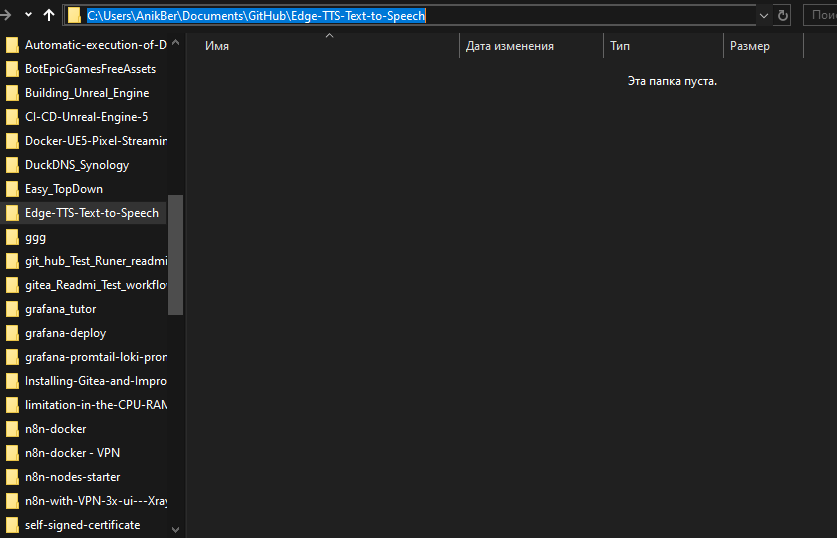
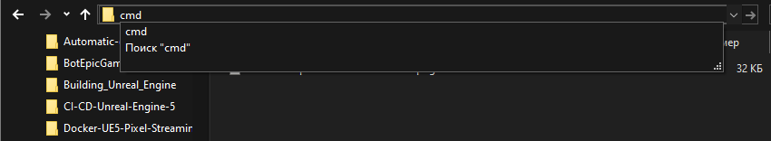
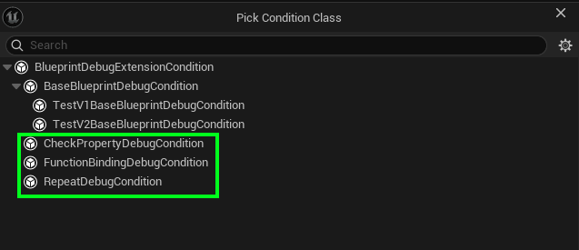
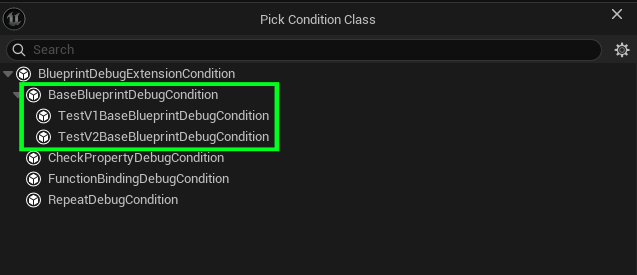

  <strong>-------></strong>
  <a href="/README.ru.md">Русский</a> |
  <a href="/docs/README.md">English</a>
  <strong><-------</strong>

  <picture>
    <source media="(prefers-color-scheme: dark)" srcset="./media/logo-dark.png">
    
  </picture>

---

<h1 align="center"> 
Test Integrate Conditional Breakpoint In Blueprint For Unreal Engine
</h1>

<h2 align="center"> 
    ⚠️ Отказ от ответственности ⚠️
</h2> 

  Автор не несёт ответственности за любые возможные последствия использования данного проекта.
  Используя материалы репозитория, вы автоматически соглашаетесь с условиями лицензионного соглашения, связанными с ним.

 
  
⚠️полный текст⚠️

1. Используя материалы репозитория, вы автоматически соглашаетесь с условиями лицензионного соглашения, связанными с ним.

2. Автор не предоставляет никаких гарантий, явных или подразумеваемых, относительно точности, полноты или пригодности этого материала для каких-либо конкретных целей. 
3. Автор не несёт ответственности за любые убытки, включая, помимо прочего, прямые, косвенные, сопутствующие, косвенные или специальные убытки, возникшие из-за использования или невозможности использования этого материала или сопровождающей его документации, даже если о возможности таких убытков было заранее сообщено.

4. Используя этот материал, вы подтверждаете и принимаете на себя все риски, связанные с его применением. Кроме того, вы соглашаетесь, что автор не может быть привлечён к ответственности за какие-либо проблемы или последствия, возникшие в результате его использования.

* * * * * * * * * * * * * * * * * * 
* * * * * * * * * * * * * * * * * * 

<h1 align="center">📊 Установка</h1>

<h3 align="left">1. Выбираем папку куда будет выгружен плагин и выделяем путь до файла</h3>

  

<h3 align="left">2. В поле с путём удаляем всё, вводим команду <code>cmd</code> и нажимаем <code>Enter</code></h3>

  

<h3 align="left">3. Откроется командная консоль. Вводим команду для скачивания репозитория:</h3>

  <pre><code>git clone https://github.com/SoulofAO/ConditionBreakpointUnrealEngine.git</code></pre>

<h3 align="left">4. Переносим плагин <code>ConditionBreakpointUnrealEngine</code> в папку <code>Plugins</code> вашего проекта</h3>

* * * * * * * * * * * * * * * * * * 
* * * * * * * * * * * * * * * * * * 

<h1 align="center">📊 Работа с кодом</h1>

<h3 align="left">1. Нажмите правой кнопкой и откройте <code>Open Settings:</code> в разделе <code>CONDITIONAL BREAKPOINTS</code> выберите пунт <code>OpenBreakpointConditionSettings</code></h3>

  

<h3 align="left">2. Откроется <code>Main Control Panel</code> в левом углу нажимаем на кнопку добавить условия <code>Add Conditions:</h3>

  
  

* * * * * * * * * * * * * * * * * * 
* * * * * * * * * * * * * * * * * * 

<h1 align="center">Список условий</h1>

  

---

 
    1. <code> Check Property Debug Condition </code> – Условие на основе простых проверок, таких как равенство и другие операторы, между свойством и константой или между двумя свойствами. Существует расширение под GetName для UObject Ref.

  

---

 
    2. <code> Function Binding Debug Condition </code> – связывает условие точки отладки с вызовом функции Blueprint.

  

---

 
    3. <code> Repeat Debug Condition </code> – Условие, которое позволяет задать проверку на основе количества срабатываний точки прерывания (Breakpoint).

  

---
---

<h1 align="center">📊 Плагин позволяет создавать кастомные условия <code>(Custom Condition)</code>.</h1>

 
    Для этого нужно унаследовать <code> Blueprint</code> от базового класса <code> Base Blueprint Debug Condition </code>.

 

  

---

 
    Все условия являются булевыми и могут комбинироваться друг с другом. Для этого <code>List Condition</code> имеет операции <code>And</code> и <code>Or</code>, как простейшие булевы выражения.

  

---

<h2 align="center">
> 💡 Дополнительную информацию:
</h2>

 
Для конкретной точки прерывания можно раскрыть с помощью <code>Custom Extender Context</code>.
В этом случае её можно получить для <code>Base Blueprint Extender Condition</code> через <code>Get New Global Custom Extender By Object</code>. Это позволяет создавать накопительные условия для <code>Breakpoint</code>.
Все примеры можно найти в <code>Content Plugin</code>.

* * * * * * * * * * * * * * * * * * 
* * * * * * * * * * * * * * * * * * 

<h1 align="center"> 📜 Лицензия</h1>
<h2 align="center">
  <strong>-------></strong>
  <strong> Этот проект распространяется по </strong> 
  <a href="./LICENSE">SoulofAO License</a>
  <strong><-------</strong>
</h1>

---

<h1 align="center">📬 Обратная связь</h1>

Если у Вас возникли проблемы или есть предложения — создайте
<a href="https://github.com/SoulofAO/ConditionBreakpointUnrealEngine/issues">Issue</a>
или 
<a href="https://github.com/SoulofAO/ConditionBreakpointUnrealEngine/pulls">Pull Request</a>

---

<h2 align="center"> 
📚 Документация ознакомьтесь с ней 
</h2>

  <strong>-------></strong>
  <a href="/docs/README.md">English</a> |
  <a href="/README.ru.md">Русский</a>
  <strong><-------</strong>

